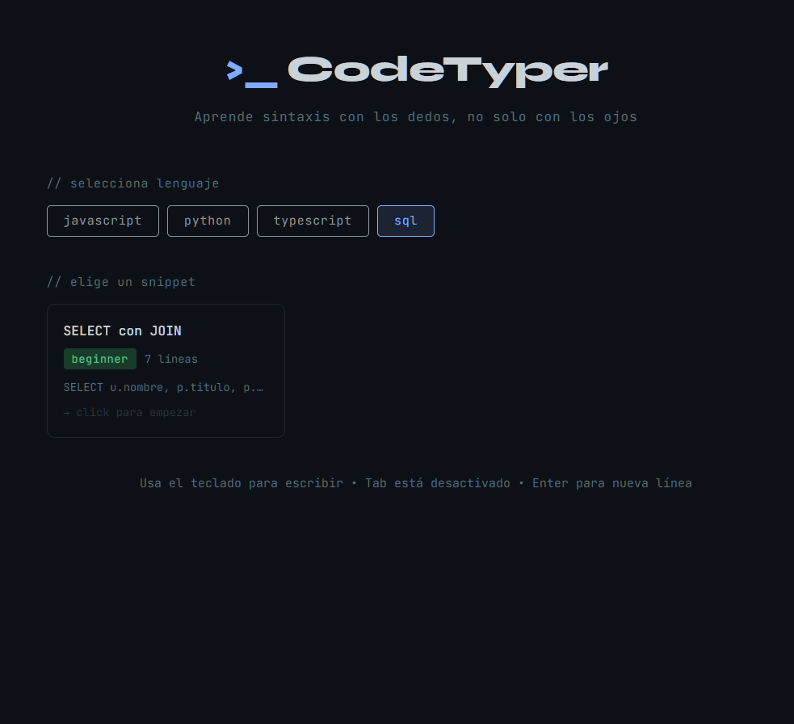
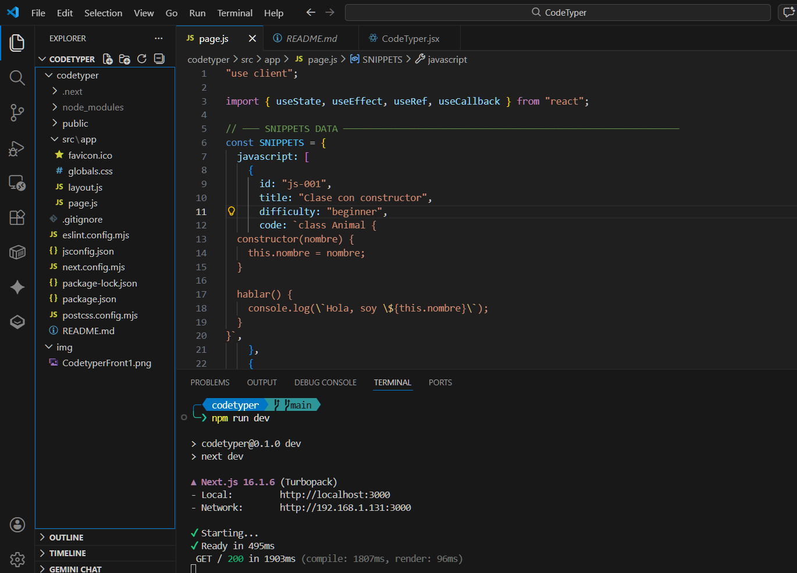

<div align="center">

<br/>



<br/>
<br/>

# &gt;_ CodeTyper

### Learn syntax with your fingers, not just your eyes.

A typing practice app for developers — write real code character by character,  
with **live semantic highlighting** that shows you exactly what each token means  
as you type it: keyword, variable, class, string, function, and more.

<br/>

[](https://nextjs.org/)
[](https://react.dev/)
[](https://tailwindcss.com/)
[](https://developer.mozilla.org/en-US/docs/Web/JavaScript)
[](LICENSE)
[](https://codetyper-eight.vercel.app)

<br/>

</div>

---

<div align="center">

## ✨ What is CodeTyper?

</div>

Most typing trainers give you *words*. CodeTyper gives you **real code**.  
As you type, every character you complete lights up with its **semantic color** — just like your IDE — so your brain starts associating muscle memory with code structure automatically.

<br/>

<div align="center">



<br/>
<br/>

</div>

---

<div align="center">

## 🚀 Features

</div>

- **⌨️ Code-first typing trainer** — practice real, useful snippets, not toy examples
- **🎨 Live semantic highlighting** — colors update in real time as you type: keywords, strings, classes, functions, operators...
- **❌ Error detection** — wrong character? It flashes red and waits. No skipping allowed.
- **📊 Session metrics** — CPM, accuracy percentage, total errors, and time
- **🏆 Grading system** — get rated S / A / B / C / D based on your accuracy
- **🗂️ Multi-language support** — JavaScript, Python, TypeScript, SQL (more coming)
- **📚 Snippet library** — curated snippets organized by language and difficulty
- **🔄 Repeat or continue** — replay the same snippet or pick a new one after each session

---

<div align="center">

## 🛠️ Tech Stack

| Layer | Technology |
|-------|-----------|
| Framework | [Next.js 16](https://nextjs.org/) with App Router |
| UI Library | [React 19](https://react.dev/) |
| Styling | [Tailwind CSS 3](https://tailwindcss.com/) |
| Tokenizer | Custom hand-written semantic tokenizer |
| Font | [JetBrains Mono](https://www.jetbrains.com/lp/mono/) |
| State | React Hooks (`useState`, `useEffect`, `useCallback`) |
| Persistence | LocalStorage (session history) |

</div>

---

<div align="center">

## 🎨 Semantic Color Reference

| Token Type | Color | Examples |
|---|---|---|
| 🟣 Keyword | `#c792ea` | `class`, `function`, `return`, `if` |
| 🟡 Class name | `#ffcb6b` | `Animal`, `Usuario`, `MyComponent` |
| 🔵 Identifier / Variable | `#82aaff` | `nombre`, `data`, `response` |
| 🟠 String | `#f78c6c` | `"hello"`, `'world'`, `` `template` `` |
| 🟢 Number | `#f78c6c` | `42`, `3.14`, `0xFF` |
| 🩵 Operator / Type | `#89ddff` | `===`, `=>`, `number`, `boolean` |
| ⬜ Comment | `#546e7a` | `// comment`, `# comment` |
| ⚪ Punctuation | `#89ddff` | `{`, `}`, `;`, `(`, `)` |

</div>

---

<div align="center">

## 📦 Getting Started

</div>

```bash
# 1. Clone the repository
git clone git https://github.com/HEO-80/CodeTyper.git
cd codetyper

# 2. Install dependencies
npm install

# 3. Start the development server
npm run dev
```

Open [http://localhost:3000](http://localhost:3000) in your browser and start typing.
Or try the **[live demo →](https://codetyper-eight.vercel.app)** directly.

---

<div align="center">

## 📁 Project Structure

</div>

```
codetyper/
├── src/
│   └── app/
│       ├── page.js          # Main app (menu, practice, results)
│       ├── layout.js        # Root layout
│       └── globals.css      # Global styles
├── img/                     # Screenshots and assets
├── public/                  # Static files
└── README.md
```

---

<div align="center">

## 🗺️ Roadmap

- [ ] Add 30+ snippets across all languages
- [ ] Rust, Go, C++ support
- [ ] Dark / light theme toggle
- [ ] Import your own code to practice
- [ ] Daily streak tracking
- [ ] Global leaderboard
- [ ] Keyboard sound effects
- [ ] Line-by-line mode for long snippets

</div>

---

<div align="center">

## 🤝 Contributing

Contributions, issues and feature requests are welcome!  
Feel free to open a [pull request](../../pulls) or file an [issue](../../issues).

---

## 📄 License

This project is licensed under the **MIT License** — see the [LICENSE](LICENSE) file for details.

---

<br/>

Made with ⌨️ and ☕ by a developer who got tired of forgetting syntax

<br/>

</div>